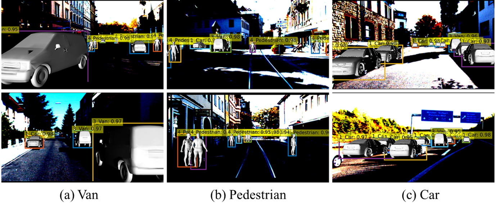
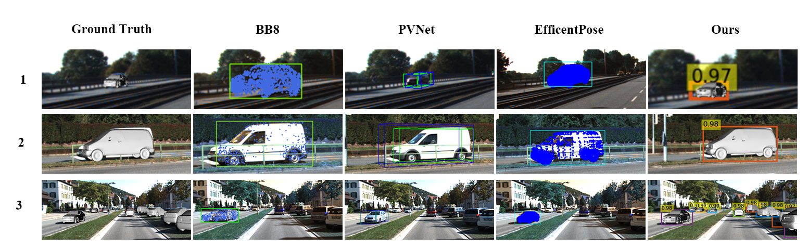
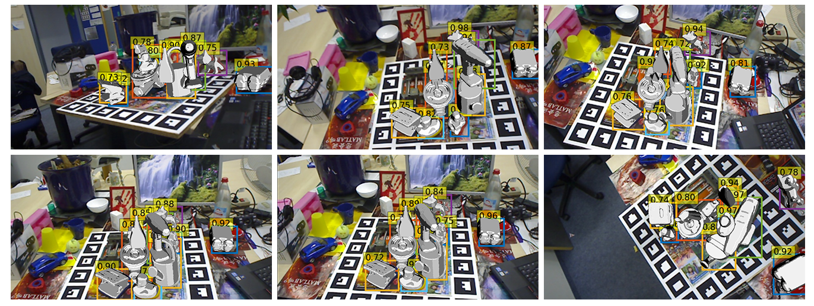
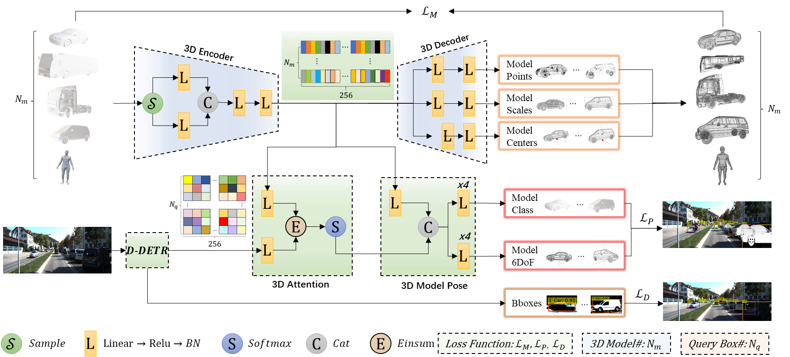

# [SMOPE-Net]()

We introduce the **S**imultaneous **M**ultiple **O**bject detection and **P**ose **E**stimation **N**etwork (**SMOPE-Net**) that performs multi-target detection and pose estimation tasks in an end-to-end manner. SMOPE-Net extracts the object model features and fuses the model features with the image features to infer the object categories, 2-D detection boxes, poses, and visibility. We perform experiments and comparisons to existing methods on multiple datasets including the new KITTI-3D dataset and the existing LineMod-O datasets. And our method achieves better than existing methods forpose estimation on both datasets.

------

- [SMOPE-Net](#smope-net)
  - [Results](#results)
  - [RoadMap](#roadmap)
  - [SMOPE-Net](#smope-net)
  - [Installation](#installation)
    - [Requirements](#requirements)
    - [Compiling CUDA operators](#cuda)
  - [Preparation](#preparation)
  - [KITTI-3D](#kitti-3d)
    - [Test](#test)
    - [Train](#train)
  - [LineMod-O](#linemod-o)
    - [Test](#test-1)
    - [Train](#train-1)
  - [Citation](#citation)
  - [Acknowledge](#acknowledge)
  - [License](#license)

------

## Results

> SMOPE-Net on KITTI-3D dataset 



> Comparison results on KITTI-3D dataset



> SMOPE-Net on LineMod-O dataset




## RoadMap

| Date   | Event                                                        |
| ------ | ------------------------------------------------------------ |
| 202204 | Finish the papers :-)                                        |
| 202203 | Preparing papers                                             |
| 202201 | Get Result on [LineMod-0](https://drive.google.com/file/d/1nEtIAb0-AwoS8yNa2BQaoWn387xFdF9S/view?usp=sharing) dataset |
| 202201 | Can Train on [LineMod-0](https://drive.google.com/file/d/1nEtIAb0-AwoS8yNa2BQaoWn387xFdF9S/view?usp=sharing) dataset |
| 202112 | Get Result on [KITTI-3D](https://github.com/CongliangLi/LabelImg3D) dataset |
| 202112 | Can Train on [KITTI-3D](https://github.com/CongliangLi/LabelImg3D) dataset |
| 202111 | Optimized this network                                       |
| 202110 | Can Do the Basic Detection and Pose Estimation               |
| 202109 | Design the Loss Fucntion                                     |
| 202108 | Try the [KITTI-3D](https://github.com/CongliangLi/LabelImg3D)  dataset |
| 202107 | Re-design the Model-Net                                      |
| 202106 | Design the whole network                                     |
| 202105 | Start this idea                                              |


## SMOPE-Net

Schematics of end-to-end trainable SMOPE-Net: The network expects images and $N_m$ 3D object models as input. The Deformable-DETR (D-DETR) block provides a 256-dimensional feature vector for each of the  queries. It also provides detected bounding boxes (Bboxes) for the input image under the loss . A 3D Encoder learns a 256-dimensional latent space from the 3D models. The features of  models in this space are used by the 3D Decoder to estimate model points, scales and centers to reconstruct the  models under the loss . The  latent features are also used by the 3D Attention module to compute attention maps for the queries, and 3D Model Pose module to subsequently predict model class and object 6DoF pose estimates. Both components are used for computing the  loss.




## Installation

### Requirements
* Linux, CUDA>=10.0, GCC>=5.4
  
* Python>=3.8

    We recommend you to use Anaconda to create a conda environment:
    ```bash
    conda create -n detr_6dof python=3.8 pip
    ```
    Then, activate the environment:
    ```bash
    conda activate detr_6dof
    ```
  
* PyTorch>=1.9.1  (following instructions [here](https://pytorch.org/))

    For example, if your CUDA version is 10.2, you could install pytorch and torchvision as following:
    ```bash
    conda install -c pytorch pytorch=1.9.1 torchvision cudatoolkit=10.2
    ```
  
* PyTorch3D (following instructions [here](https://github.com/facebookresearch/pytorch3d))

    - Using Anaconda Cloud,on Linux only

    ```bash
    conda install pytorch3d -c pytorch3d
    ```

    - Installing From Source（Install from GitHub）.

    ```bash
    pip install "git+https://github.com/facebookresearch/pytorch3d.git"
    ```


* Other requirements
    ```bash
    pip install -r requirements.txt
    ```
    

### Compiling CUDA operators  <div id="cuda"></div>
```bash
cd ./models/ops
sh ./make.sh
```

## Preparation
- Clone this repository

  ```shell
  git clone <repository url>
  ```


## KITTI-3D

- Download the dataset from [here](https://github.com/CongliangLi/LabelImg3D/#Dateset).

- Run the creat_dataset.py
```shell
cd dataset_labelImg3d
python creat_dateset.py
```

### Test

- Download the network [weights file](https://drive.google.com/file/d/1dJBGhi-zbJE9eexaVRrKcHDoghuwaY-V/view?usp=sharing)

- Modify the `<project path>/configs/__init__.py` to

  ```python
  7. configure_name = "config.json"
  8. # configure_name = 'config_linemod.json'
  ```
  
- Modify the `<project path>/configs/config.json`

  ```python
  1.    {
  2.       "dataset_name": "KITTI3D",
  3.       "dataset_path": <your downloaded KITTI-3D folder>,
  4.		 "poses": true,
  5.		 "eval": true,
      ...
  11.		 "output_dir": "../output_dir_pose",
  	...
  76.		 "train": {
  	...		
  79.		 	"resume": <your downloaded weights>,
  ```

- Activate your python environment, and run

  ```shell
  cd <project folder>
  python main.py
  ```

### Train

- Modify the `<project path>/configs/__init__.py` to

  ```python
  7. configure_name = "config.json"
  8. # configure_name = 'config_linemod.json'
  ```
  
- Modify the `<project path>/configs/config.json`

  ```python
  1.    {
  2.       "dataset_name": "KITTI3D",
  3.       "dataset_path": <your downloaded KITTI-3D folder>,
  4.		 "poses": true,
  5.		 "eval": false,
      ...
  11.		 "output_dir": "../output_dir_pose",<your save folder>
  	...
  76. 	"train": {    
  77.        	"start_epoch": 0,
  78.    		"end_epoch": 1000,
  79.    		"resume": "",
  80.    		"batch_size": 4 <you can change it according to your gpu capability>,
      ...
      
  ```

- Activate your python environment, and run

  ```shell
  cd <project folder>
  python main.py
  ```

## LineMod-O

- Download the training and testing dataset from [here](https://drive.google.com/file/d/182mXo1vnTNaXNa-zFJzRYv64BBqoWirD/view?usp=sharing)

### Test

- Download the network [weights file]()

- Modify the `<project path>/configs/__init__.py` to

  ```python
  7. # configure_name = "config.json"
  8. configure_name = 'config_linemod.json'
  ```
  
- Modify the `<project path>/configs/config_linemod.json`

  ```python
  1.    {
  2.       "dataset_name": "Linemod_preprocessed",
  3.       "dataset_path": <your downloaded KITTI-3D folder>/02,
  4.		 "poses": true,
  5.		 "eval": true,
      ...
  11.		 "output_dir": "../output_dir_pose",
  	...
  76.		 "train": {
  	...		
  79.		 	"resume": <your downloaded weights>,
      ...
  ```
  
- Activate your python environment, and run

  ```shell
  cd <project folder>
  python main.py
  ```

### Train

- Modify the `<project path>/configs/__init__.py` to

  ```python
  7. # configure_name = "config.json"
  8. configure_name = 'config_linemod.json'
  ```
  
- Modify the `<project path>/configs/config_linemod.json`

  ```python
  1.    {
  2.       "dataset_name": "Linemod_preprocessed",
  3.       "dataset_path": <your downloaded Linemod_preprocessed folder>/02,
  4.		 "poses": true,
  5.		 "eval": false,
      ...
  11.		 "output_dir": "../output_dir_pose",<your save folder>
  	...
  81. 	"train": {    
  82.        	"start_epoch": 0,
  83.    		"end_epoch": 1000,
  84.    		"resume": "",
  85.    		"batch_size": 4 <you can change it according to your gpu capability>,
      ...
      
  ```

- activate your python environment, and run

  ```shell
  cd <project folder>
  python main.py
  ```

## Citation

```

```

## Acknowledge

This work is based on the [Pytroch](https://github.com/pytorch/pytorch), [Pytorch3D](https://github.com/facebookresearch/pytorch3d) and [Deformable-DETR](https://github.com/fundamentalvision/Deformable-DETR). It also inspired by [DETR](https://github.com/facebookresearch/detr).

## License

The methods provided on this page are published under the [Creative Commons Attribution-NonCommercial-ShareAlike 3.0 License](http://creativecommons.org/licenses/by-nc-sa/3.0/) . This means that you must attribute the work in the manner specified by the authors, you may not use this work for commercial purposes and if you alter, transform, or build upon this work, you may distribute the resulting work only under the same license. If you are interested in commercial usage you can contact us for further options.
